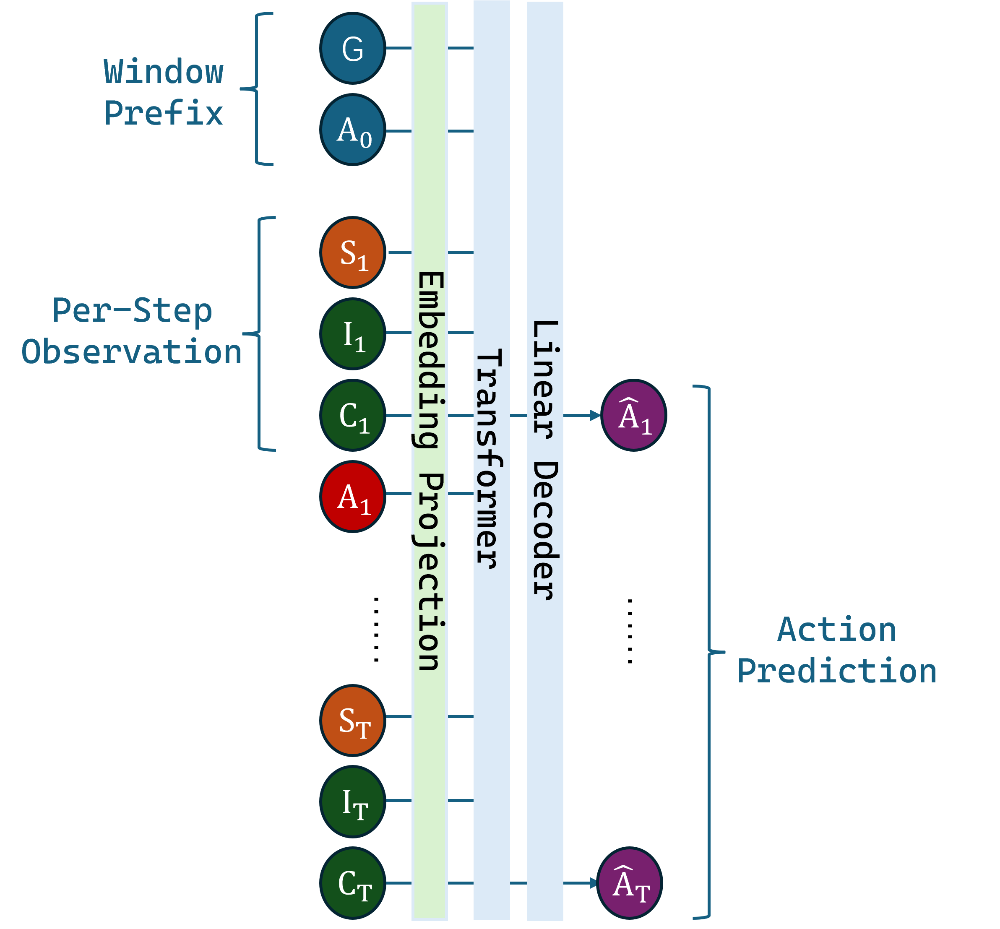

# Incremental Signature Contribution Transformer (ISCT)

A novel approach to offline reinforcement learning that leverages **path signature theory** to capture temporal dynamics in sequential decision-making tasks. This implementation extends the Decision Transformer architecture with the **Incremental Signature Contribution (ISC)** method, providing enhanced modeling of trajectory evolution.

## Overview

The Incremental Signature Contribution Transformer (ISCT) introduces **ISC tokens** that encode the evolution of state trajectories using concepts from rough path theory:

- **INC tokens**: First-level incremental signature contributions (path differentials)
- **CROSS tokens**: Second-level signature contributions capturing cross-correlations between state dimensions
- **Token of higher level**: Higher level signature contributions capturing high-order corrlations, for exact expression, see our paper

The ISC method decomposes path signatures into per-step contributions, enabling efficient streaming computation while preserving the expressive power of signature features. This approach captures richer temporal structure than standard position embeddings, improving performance on locomotion and navigation tasks.

## Installation

### Using Conda (Recommended)

Create and activate the environment using the provided `env.yml`:

```bash
conda env create -f env.yml
conda activate isct
```

> **Note**: If `iisignature` fails to install due to numpy version conflicts, install it separately with:
> ```bash
> pip install --no-build-isolation iisignature
> ```

### MuJoCo Setup (Windows)

For Windows users, ensure MuJoCo is properly installed:
1. Download MuJoCo from [mujoco.org](https://mujoco.org/)
2. Add the `bin` directory to your PATH, or use the `--mujoco_path` flag during evaluation

### Dataset Setup

Datasets can be set up in two ways:

**Option 1: Automatic Download**

Use the `--download` flag and the script will automatically download the dataset:

```bash
python train.py --env halfcheetah-medium --download
```

**Option 2: Manual Download**

1. Download HDF5 datasets from [https://rail.eecs.berkeley.edu/datasets/offline_rl/](https://rail.eecs.berkeley.edu/datasets/offline_rl/)
2. Place them in the `./d4rl_datasets/` directory (or specify a custom path with `--data_dir`)
3. Expected file naming: `{env_name}-v2.hdf5` (e.g., `halfcheetah_medium-v2.hdf5`)

```
d4rl_datasets/
├── halfcheetah_medium-v2.hdf5
├── hopper_medium-v2.hdf5
├── walker2d_medium-v2.hdf5
├── maze2d_medium-v1.hdf5
└── ...
```

## Usage

### Training

Train an Incremental Signature Contribution Transformer on D4RL datasets:

```bash
# MuJoCo Locomotion (uses GOAL mode automatically)
python train.py --env halfcheetah-medium --epochs 200 --batch_size 256

# Maze2D Navigation (uses RTG mode automatically)
python train.py --env maze2d-medium --epochs 200 --stride 10

# With automatic dataset download
python train.py --env walker2d-medium-expert --download --epochs 200

# Custom configuration
python train.py \
    --env hopper-medium \
    --window_size 50 \
    --n_layer 4 \
    --n_head 4 \
    --n_embd 128 \
    --batch_size 256 \
    --epochs 200 \
    --lr 1e-3 \
    --save_dir ./checkpoints
```

#### Training Arguments

| Argument | Default | Description |
|----------|---------|-------------|
| `--env` | `halfcheetah-medium` | D4RL environment name |
| `--data_dir` | `./d4rl_datasets` | Directory containing HDF5 dataset files |
| `--download` | `False` | Download dataset if not found locally |
| `--window_size` | `50` | Context window size (timesteps) |
| `--stride` | `None` | Stride for sliding window (auto-set for navigation) |
| `--batch_size` | `256` | Training batch size |
| `--epochs` | `200` | Number of training epochs |
| `--lr` | `1e-3` | Learning rate |
| `--n_layer` | `4` | Number of transformer layers |
| `--n_head` | `4` | Number of attention heads |
| `--n_embd` | `128` | Embedding dimension |
| `--save_dir` | `./checkpoints` | Directory to save checkpoints |
| `--save_freq` | `50` | Save checkpoint every N epochs |

### Evaluation

Evaluate a trained model on D4RL environments:

```bash
# Basic evaluation
python eval.py --checkpoint ./checkpoints/model.pt --episodes 10

# With custom goal/RTG value
python eval.py --checkpoint ./checkpoints/model.pt --goal 350 --episodes 20

# Maze2D with trajectory visualization
python eval.py --checkpoint ./checkpoints/maze_model.pt --episodes 5 --plot

# Force CPU evaluation
python eval.py --checkpoint ./checkpoints/model.pt --force_cpu
```

#### Evaluation Arguments

| Argument | Default | Description |
|----------|---------|-------------|
| `--checkpoint` | *required* | Path to checkpoint `.pt` file |
| `--env` | `None` | Override environment (uses checkpoint metadata if not specified) |
| `--goal` | `None` | Target return value (auto-set based on environment) |
| `--episodes` | `10` | Number of evaluation episodes |
| `--max_steps` | `1000` | Maximum steps per episode |
| `--plot` | `False` | Generate trajectory visualization (Maze2D only) |
| `--render` | `False` | Render environment during evaluation |
| `--action_clip` | `1.0` | Clip actions to [-clip, clip] |

## Supported Environments

### MuJoCo Locomotion (GOAL Mode)

| Environment | State Dim | Action Dim | State Groups |
|-------------|-----------|------------|--------------|
| HalfCheetah-v2 | 17 | 6 | Joint Angles, Joint Velocities, Body |
| Hopper-v2 | 11 | 3 | Joint Angles, Joint Velocities, Body |
| Walker2d-v2 | 17 | 6 | Joint Angles, Joint Velocities, Body |

Dataset variants: `medium`, `medium-expert`, `medium-replay`

### Maze2D (RTG Mode)

| Environment | State Dim | Action Dim | State Groups |
|-------------|-----------|------------|--------------|
| maze2d-umaze-v1 | 4 | 2 | Position, Velocity |
| maze2d-medium-v1 | 4 | 2 | Position, Velocity |
| maze2d-large-v1 | 4 | 2 | Position, Velocity |

## Model Architecture



### Token Structure

The model processes sequences of tokens where each timestep generates multiple specialized tokens:

**GOAL Mode** (Locomotion):
```
[GOAL] [ACTION_prev] [OBS_0] [INC_0] [CROSS_0] [OBS_1] [INC_1] [CROSS_1] ... [OBS_T] [INC_T] [CROSS_T]
```

**RTG Mode** (Navigation):
```
[ACTION_prev] [RTG_0] [OBS_0] [INC_0] [CROSS_0] [RTG_1] [OBS_1] [INC_1] [CROSS_1] ... [RTG_T] [OBS_T] [INC_T] [CROSS_T]
```

### Incremental Signature Contribution (ISC)

The ISC method decomposes the path signature into per-step contributions. For each timestep $t$, given state groups $\{G_1, G_2, ..., G_k\}$:

1. **Increment**: $\Delta s_t^{(g)} = s_t^{(g)} - s_{t-1}^{(g)}$ for group $g$

2. **First-level ISC** (INC token): $S^{(1)}\_t = \sum_{i \leq t} \Delta s_i$

3. **Second-level ISC** (CROSS token): $\Delta S^{(2)}\_t = S^{(1)}_{t-1} \otimes \Delta s_t + \frac{1}{2} \Delta s_t \otimes \Delta s_t$

> **Note**: For higher-order ISC terms and the general recursive expression, please refer to the paper.

### Network Architecture

```
Input Tokens → Token Embedding → GPT Transformer → Action Head → Predicted Action
                    ↑
              Type Embeddings
              + Value Projections
              + Position Embeddings
```

- **Token Embedding**: Projects each token type (GOAL, ACTION, OBS, INC, CROSS, RTG) using dedicated linear layers
- **GPT Backbone**: Causal transformer with configurable depth (default: 4 layers, 4 heads, 128 dim)
- **Action Head**: Linear projection from embedding to action space

## Checkpoint Format

Saved checkpoints contain:

```python
{
    "train_meta": {
        "env_name": str,
        "obs_dim": int,
        "act_dim": int,
        "T_window": int,
        "mode": str,  # "goal" or "rtg"
        "groups": [...],
        "transformer": {"n_layer": int, "n_head": int, "n_embd": int, ...},
        ...
    },
    "normalization": {
        "obs_mean": np.ndarray,
        "obs_std": np.ndarray,
        "act_mean": np.ndarray,
        "act_std": np.ndarray,
    },
    "gpt_trunk_state_dict": {...},
    "embed_state_dict": {...},
    "action_head_state_dict": {...},
    "optimizer_state_dict": {...},
    "losses": [...]
}
```

## Example Results

After training, evaluation outputs normalized D4RL scores:

```
============================================================
RESULTS
============================================================
Environment: halfcheetah-medium-v2
Return: mean=4521.3 std=312.4 min=4012.1 max=5102.8
Normalized Score: mean=47.2 std=3.3 min=41.9 max=53.1
Episode Length: mean=1000.0
```

## Project Structure

```
├── train.py          # Training script
├── eval.py           # Evaluation script
├── env.yml           # Conda environment specification
├── README.md         # This file
└── assets/           # Images and figures
    └── structure.png
```

The following directories will be created during training/evaluation:
- `checkpoints/` - Saved model checkpoints
- `cache_sigdt/` - Preprocessed data cache
- `d4rl_datasets/` - Downloaded D4RL datasets

## Citation(Under Work)

If you find this work useful, please consider citing:

```bibtex
@misc{zhao2026pathsignaturessequentialmodeling,
      title={From Path Signatures to Sequential Modeling: Incremental Signature Contributions for Offline RL}, 
      author={Ziyi Zhao and Qingchuan Li and Yuxuan Xu},
      year={2026},
      eprint={2602.11805},
      archivePrefix={arXiv},
      primaryClass={cs.LG},
      url={https://arxiv.org/abs/2602.11805}, 
}
```

## License

This project is released under the MIT License.

## Acknowledgments

- [minGPT](https://github.com/karpathy/minGPT) by Andrej Karpathy for the transformer architecture
- [Decision Transformer](https://arxiv.org/abs/2106.01345) for the foundational architecture
- [D4RL](https://github.com/Farama-Foundation/D4RL) for offline RL benchmarks ([datasets](https://rail.eecs.berkeley.edu/datasets/offline_rl/))
- [iisignature](https://github.com/bottler/iisignature) for path signature computation


